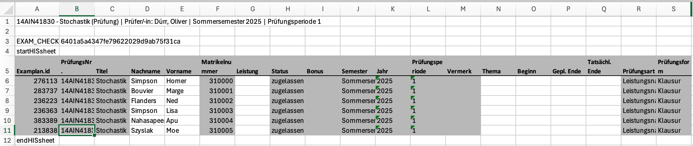

# HTWG Grade Calculator - Documentation

🎥 [Demo Video auf Panopto](https://video.htwg-konstanz.de/Panopto/Pages/Viewer.aspx?id=c90020c7-7cbb-4800-b5fb-b326012e2d2c)

1. Punkte in Excel oder tab-separierte Textdatei eintragen. Die erste Spalte muss "mtknr" heißen.
2. Excel-Datei hochladen (Upload Grading File). 
3. Schieberegler für P1 (1.0) (Anzahl der Punkte für Note 1.0) und P4 (Anzahl der Punkte für Note 4.0) anpassen (das legt die lineare Interpolation fest).
4. Matrikelnummern aus der offiziellen Excel-Vorlage der Hochschule kopieren und in die App einfügen.
5. Die App sortiert die Matrikelnummern und berechnet die Noten entsprechend der Hochschule
6. Noten in die offizielle Excel-Vorlage der Hochschule kopieren.


## 📋 Dateiformate
Die Datei mit punkten entweder als Excel- oder tab-separierte Textdatei muss folgendes Format haben:
```
mtknr   Aufgabe1   Aufgabe2   Aufgabe3   
12345   8.5        7          9.0     
67890   6.5        8          7.5     
```
*(Gesamtpunkte und Noten werden automatisch berechnet)*



*Im obigen Beispiel enthält die Spalte **F** die Matrikelnummern der Studierenden, die in die App kopiert werden müssen. Sobald die Noten berechnet wurden, sollten die Ergebnisse zurück in die Spalte **G** kopiert werden.*


Eine anonymisierte Excel-Datei mit Testdaten ist im Repository enthalten (`docs/Matrikel_Punkte.xlsx`). Eine Anonymisierte HTWG HIS-in-one 🤮 Excel-Datei ist in (`docs/his_in_one_demo.xlsx`).

