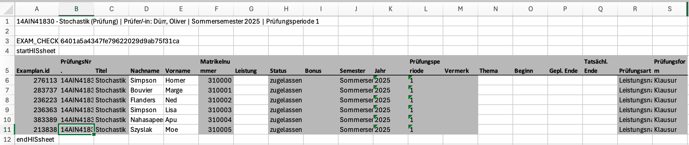

## Quick Reference: HTWG Grade Calculator


### 1. Prepare Your File
And all the points for all tasks in a single file.
- First column: **mtknr** (student IDs)
- Other columns: Task scores (numbers only)
- Save as Excel (`.xlsx`) or tab-separated text (`.txt`, `.tsv`)

### 2. Upload & Adjust
- Upload your file → App calculates totals
- Move **P4 slider** (points for grade 4.0)
- Move **P1 slider** (points for grade 1.0)
- Watch the charts and pass rate

### 3. University Workflow
- Copy student IDs from university Excel
- Paste into "Student IDs" field
- Click "Process ID Order"
- Click "Copy Grades to Clipboard"
- Paste into university Excel template


## 📋 File Formats 

File with points (you need to upload) either Excel or tab-separated text file  following structure:
```
mtknr   Task1   Task2   Task3   
12345   8.5     7     9.0     
67890   6.5     8     7.5     
```
*(Total_Points and Grade are calculated automatically)*



*In the above example, column **F** contains the student IDs that need to be copied into the app. Once the grades are calculated, the results should be copied back into column **G**.*


## 🔧 Common Issues

| Problem | Solution |
|---------|----------|
| "First column must be mtknr" | Rename first column header to exactly "mtknr" |
| No data appears | Check file format, ensure numeric task scores |
| Wrong grade distribution | Adjust P1/P4 sliders, check point ranges |
| Missing students in output | Normal - these students not in your grading file |

---
